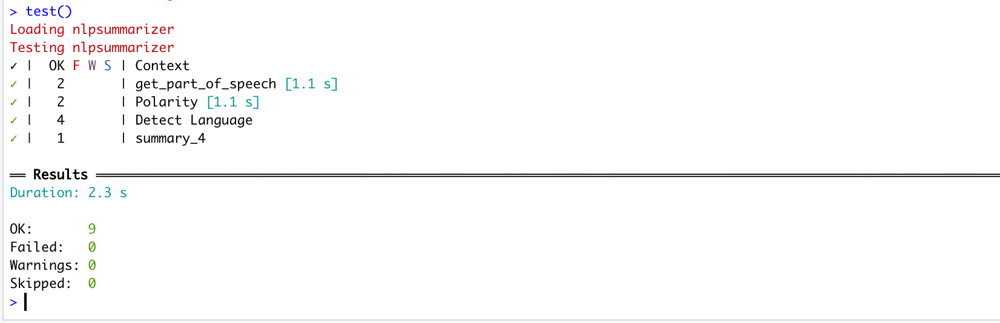

[](https://codecov.io/gh/UBC-MDS/nlpsummarizer)


<html>

</html>

# NLPSummmarizer

<!-- badges: start -->

<!-- badges: end -->

R package generates the summary of textual data

## The Project


One of the most relevant applications of machine learning for corporations globally is the use of natural language processing (NLP). Whether it be parsing through business documents to gather key word segments or detecting Twitter sentiment of a certain product, NLP’s use case is prevalent in virtually every business environment.

Unfortunately, there are few tools today which provide summary statistics on textual data that a user may want to analyze. Our goal with this package is to provide users with a simple and flexible tool to gather key insights that would be useful during the exploratory data analysis phase of the data science workflow. 

Our library specifically will make extensive use of pre-existing packages in the R eco-system. We will use the `textcat` and `openNLP` library to build most of the sentiment analysis functions while also leveraging well-known packages such as `tidyverse` to aid in the overall presentation of our final output results. 

To the best of our knowledge, there is no any other library that combines all the below mentioned functionality in one.

## Installation


And the development version from [GitHub](https://github.com/) with:

``` r
install.packages("devtools")
devtools::install_github("UBC-MDS/nlpsummarizer)
```

### Dependencies

- textcat
- openNLP
- tidyverse
- udpipe
- readxl
- readr
- stringr
- quanteda
- stopwords
- tm


## Functions


`detect_language`: This function will parse through the textual data and come up with the language of the text. This can be useful for an international company’s customer service process in detecting which regions are requesting the most help.

`part_of_speech`: This function will generate key statistics on the proportions of textual data points including verbs, prepositions, adjectives, nouns and articles.

`polarity`: This function will check the overall sentiment of the data by assessing the number of negative, positive and neutral words in the textual data. 

`sentence_stopwords_freq`: This function will check the proportion on the number of sentences, stop words and also output high frequency words in the textual data. 

## Example

This is a basic example which shows you how to generate a summary:

``` r
library(nlpsummarizer)
df <- data.frame(text_col =  c('I love travelling to Japan and
                           eating Mexican food but I can only speak
                           English!'))

get_language(df$text_col)

[1] 'English'

get_part_of_speech(df$text_col)

[2]  |   verbs    | prepositions | adjectives |   nouns   |  articles  |
     |    0.2     |     0.11     |     0.3    |    0.06   |     0.18   |

get_polarity(df$text_col)

[3] | positive words | negative words | neutral words |
    |         3      |           0    |    15         |

summary_4(df$text_col)

[4] | number of sentences | number of stop words | high freq. words |
    |         1           |           4          |    I(2)          |

```
